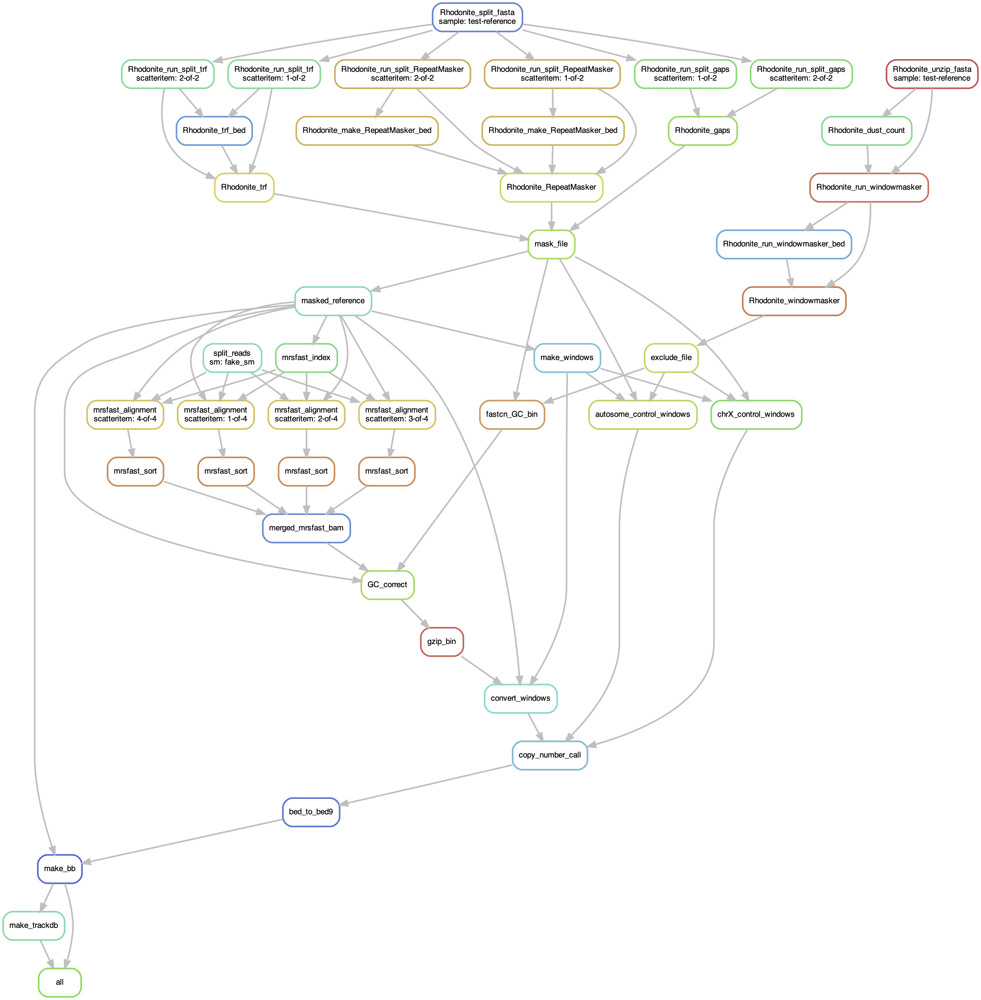

# A snakemake for fastCN reference setup

The `Snakefile` is under `workflow`.

## Installing

Most installing is done by `Snakemake` but there is one small Makefile. Please refer to it so you can properly set your LD path before using.

## Configuration

See `config/config.yaml` for an example layout, and `.test/config.yaml` for a minimal test case.

## Workflow layout

